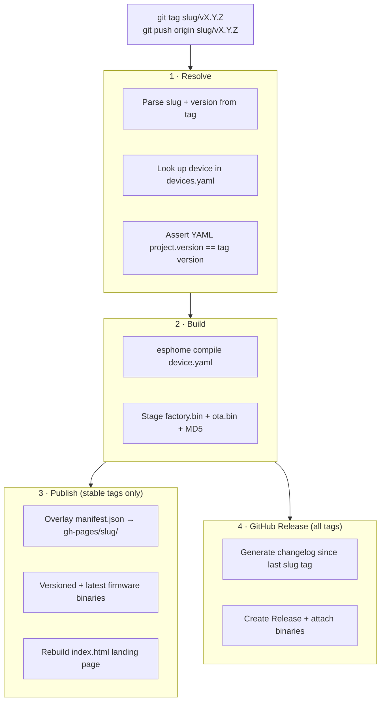

# Contributing

Thank you for your interest in contributing. This guide covers the development
environment, conventions, and the process for common contribution types.

---

## Repository layout

```
.
├── devices.yaml                    # registry: one entry per releasable device
├── airgradient-one.yaml            # ESPHome config for the ONE
├── packages/
│   ├── airgradient_esp32-c3_board.yaml    # ESP32-C3 board + UART/I2C pin config
│   ├── led.yaml                           # WS2812 LED strip base (brightness, fade)
│   ├── led_combo.yaml                     # 11-LED strip: ten selectable modes
│   ├── display_sh1106_multi_page.yaml     # multi-page OLED with per-page HA switches
│   ├── sensor_pms5003.yaml                # PM2.5 (PMS5003, with EPA correction)
│   ├── sensor_pms5003t.yaml               # PM2.5 + temp/humidity variant (PMS5003T)
│   ├── sensor_s8.yaml                     # CO2 (SenseAir S8)
│   ├── sensor_sgp41.yaml                  # VOC + NOx (SGP41)
│   ├── sensor_sht40.yaml                  # Temperature + humidity (SHT40)
│   ├── sensor_go_iaqs.yaml                # GO IAQS score (0–10) from CO2 + PM2.5
│   ├── airgradient_api_esp32-c3.yaml      # AirGradient dashboard upload
│   ├── diagnostic_esp32.yaml              # Free memory, CPU temp, loop time
│   ├── watchdog.yaml                      # Hardware watchdog pulse
│   ├── config_button.yaml                 # GPIO button: temp unit + CO2 calibration
│   ├── captive_portal.yaml                # Fallback Wi-Fi AP + captive portal
│   ├── button_factory_reset.yaml          # Factory-reset button
│   ├── sensor_wifi.yaml                   # Wi-Fi RSSI sensor
│   └── sensor_uptime.yaml                 # Device uptime sensor
├── docs/
│   ├── led.md                      # LED indicator reference
│   ├── display.md                  # Display pages reference
│   ├── firmware.md                 # Installing firmware + OTA + published URLs
│   └── images/
│       └── esphome_flash.png
├── scripts/
│   ├── build_manifest.py           # writes per-device manifest.json
│   └── build_landing_page.py       # rebuilds the Pages index listing every device
├── pyproject.toml                  # pins esphome + pyyaml
├── .github/workflows/
│   ├── build-firmware.yml          # tag-driven build + release + Pages
│   └── validate.yml                # PR-time config validation, matrixed
└── README.md
```

---

## Development environment

```bash
git clone https://github.com/luukvisser/airgradient_esphome.git
cd airgradient_esphome

uv sync                        # creates .venv and installs esphome + pyyaml
source .venv/bin/activate      # Windows: .venv\Scripts\activate
```

Validate a config without building firmware:

```bash
esphome config airgradient-one.yaml
```

Build firmware locally:

```bash
esphome compile airgradient-one.yaml
```

Build and flash over USB or OTA:

```bash
esphome run airgradient-one.yaml
```

---

## Repository conventions

### YAML ordering

Within every device YAML and package, follow this top-level key order:

1. `substitutions`
2. `esphome`
3. `logger`
4. `api`
5. `ota`
6. `http_request`
7. `update`
8. `wifi` / `network`
9. `captive_portal` / `esp32_improv` / `improv_serial`
10. `web_server`
11. `dashboard_import`
12. Component sections (`sensor`, `binary_sensor`, `button`, `number`, `select`,
    `switch`, `light`, …)
13. `script` / `interval` / `globals`
14. `packages` (device YAMLs only)

Within a component list, sort entities by their `id` or `name` alphabetically where the
ordering has no semantic meaning.

### Naming

| Thing                 | Convention        | Example                  |
| --------------------- | ----------------- | ------------------------ |
| Device slug           | `kebab-case`      | `airgradient-one`        |
| Package file          | `snake_case.yaml` | `sensor_sht40.yaml`      |
| Entity `id`           | `snake_case`      | `co2`, `led_brightness`  |
| Entity `name`         | Title Case        | `"Carbon Dioxide"`       |
| Substitution key      | `snake_case`      | `pm_2_5_scaling_factor`  |
| Web server group `id` | `grp_<category>`  | `grp_sensors`, `grp_co2` |
| Sorting weight        | multiples of 10   | 10, 20, 30 …             |

### Package structure

- One package per concern (one sensor, one display, one LED mode).
- Declare `substitutions` at the top of the package with sensible defaults so the
  package works standalone.
- Use `!extend` rather than redefining top-level IDs that another package owns.
- Assign every entity to a `web_server.sorting_group_id` so the built-in web UI stays
  organized.
- Set `entity_category: config` on calibration controls, `entity_category: diagnostic`
  on debug-only entities, and leave it empty for primary measurement sensors.

### Commits

Use the conventional format: `type: short description`

| Type       | When to use                                      |
| ---------- | ------------------------------------------------ |
| `feat`     | New package or feature                           |
| `fix`      | Bug fix                                          |
| `refactor` | Internal restructuring with no functional change |
| `docs`     | README, packages.md, or inline comment changes   |
| `ci`       | Workflow file changes                            |
| `chore`    | Dependency bumps, tooling                        |

Keep the subject line under 72 characters. Add a body when the "why" isn't obvious from
the diff.

---

## Adding a new package

1. Create `packages/<name>.yaml`.
2. Put a brief comment at the very top explaining what the package does and what
   hardware/software it depends on.
3. Declare default substitutions at the top so the package documents its own knobs.
4. Add the package to `packages.md` under the appropriate category.
5. Include it in `airgradient-one.yaml` (or the relevant device YAML) and open a PR.

The `Validate configs` workflow will compile the full device config on your PR.

---

## Adding a new device

1. Add an entry to `devices.yaml`:
   ```yaml
   - slug: my-device
     name: "My Device"
     yaml: my-device.yaml
     chip_family: "ESP32-C3"
     node_name: my-device
     description: "One-line description."
   ```
2. Create `my-device.yaml` — the easiest starting point is copying
   `airgradient-one.yaml` and updating:
   - `substitutions.name` → must match `node_name` above
   - `substitutions.friendly_name`
   - `esphome.project.name` → globally unique, e.g. `luukvisser.my-device`
   - `esphome.project.version` → start at `1.0.0`
   - `update.http_request.source` →
     `https://luukvisser.github.io/airgradient_esphome/my-device/manifest.json`
   - `dashboard_import.package_import_url` → point at the new YAML
   - `packages:` → select the packages appropriate for the new hardware
3. Open a PR. CI will validate the config automatically.
4. After merge, tag the first release:
   ```bash
   git tag my-device/v1.0.0
   git push origin my-device/v1.0.0
   ```

---

## Cutting a release

1. Bump `esphome.project.version` in the device YAML.
2. Update `substitutions.config_version` to match (if present).
3. Commit with `chore(my-device): bump version to X.Y.Z`.
4. Tag and push:
   ```bash
   git tag my-device/vX.Y.Z
   git push origin my-device/vX.Y.Z
   ```

The `Build & Release Firmware` workflow validates the version, compiles firmware,
publishes to GitHub Pages, and cuts a GitHub Release automatically. Pre-release tags
(containing a `-`) are not pushed to the OTA manifest so fielded devices do not install
them automatically.

### What the pipeline does



---

## Pull request checklist

- [ ] `esphome config <device>.yaml` passes locally
- [ ] If a new package was added: `packages.md` updated
- [ ] If the device YAML changed: `project.version` bumped (or a note explaining why
      not)
- [ ] Commit messages follow the conventional format
- [ ] No secrets, API keys, or hardcoded IP addresses in any tracked file
