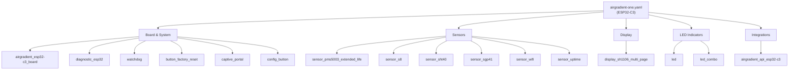
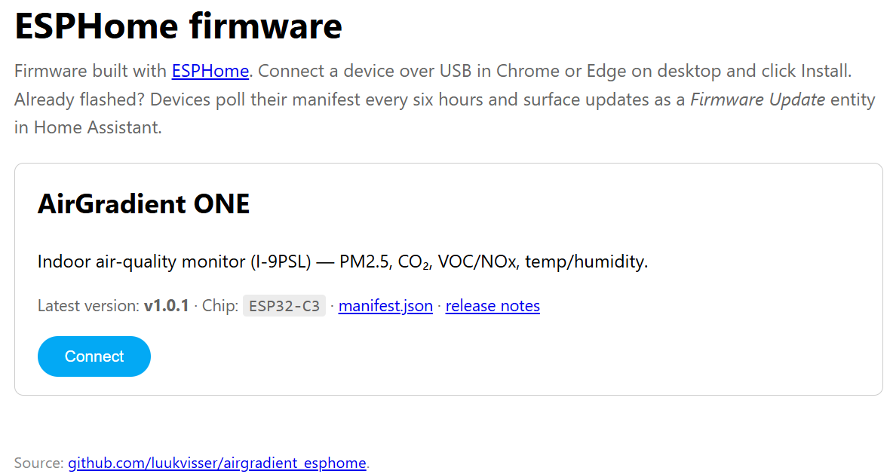
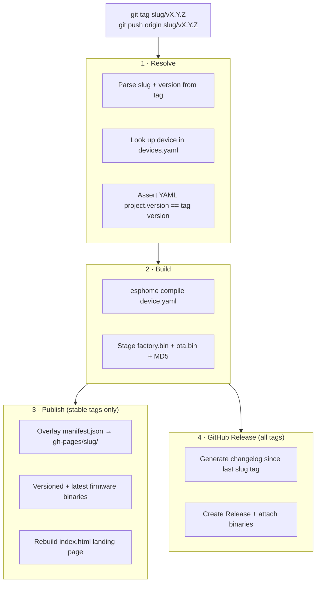
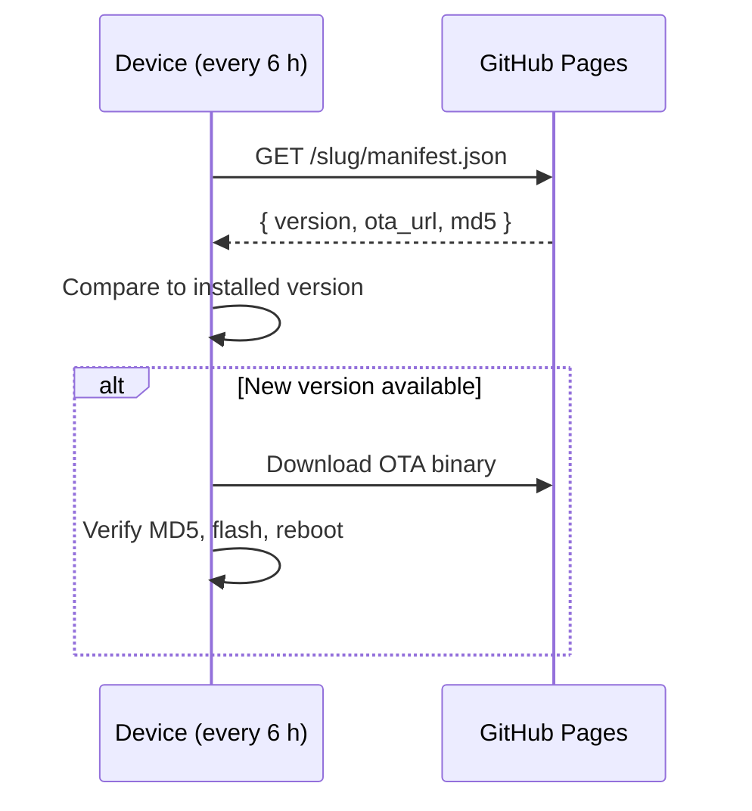

# AirGradient ESPHome firmware

[](https://github.com/luukvisser/airgradient_esphome/actions/workflows/validate.yml)
[](https://esphome.io/guides/made_for_esphome/)
[](LICENSE.txt)

ESPHome firmware for the **AirGradient ONE** (v9, ESP32-C3 indoor monitor), built on top of
[MallocArray/airgradient_esphome](https://github.com/MallocArray/airgradient_esphome).
Designed to meet the [Made for ESPHome](https://esphome.io/guides/made_for_esphome/) program requirements.

---

## Architecture

The firmware is assembled from small, single-responsibility YAML packages.
`airgradient-one.yaml` is the entry point — it declares project identity and connectivity,
then pulls in packages by category:



See [`packages.md`](packages.md) for a full description of every package and its configurable substitutions.

---

## Changes from upstream

### LED: combined multi-sensor indicator

The upstream `led_co2` package drives all LEDs from CO2 alone.
This fork replaces it with `led_combo`, which splits the 11-LED strip by sensor in **Combo** mode:


Six modes are selectable from Home Assistant or the built-in web UI:
**Combo**, **CO2**, **PM2.5**, **VOC**, **Test**, **Off**.

**Updated thresholds** — grounded in published health guidelines rather than the AirGradient dashboard defaults:

| Color | CO2 (ppm) | PM2.5 (µg/m³) | VOC index |
|-------|-----------|---------------|-----------|
| Green | < 600 | < 5 | < 100 |
| Yellow | 600 – 900 | 5 – 15 | 100 – 200 |
| Orange | 900 – 1 000 | 15 – 25 | 200 – 300 |
| Red | 1 000 – 1 200 | 25 – 35 | 300 – 400 |
| Purple | > 1 200 | > 35 | > 400 |

CO2 thresholds follow ASHRAE/UBA indoor ventilation guidance.
PM2.5 thresholds follow the 2021 WHO global air quality guidelines.
VOC thresholds follow Sensirion SGP41 index interpretation (100 = learned baseline).

**Perceptual brightness correction** — a gamma ~2.0 curve is applied to the brightness slider so the low end of the range produces visibly distinct levels instead of spending most of the range near-off.

**LED fade** — outer LEDs in each group are dimmed relative to the centre LED, giving the bar a soft edge.

### Display: multi-page OLED with per-page switches

The active display package is `display_sh1106_multi_page`. Ten pages are available, each independently toggled by a switch in Home Assistant:

| Page | Contents |
|------|----------|
| Default | Compact all-in-one: temp, humidity, CO2, PM2.5, TVOC, NOx |
| Summary 1 | CO2 · PM2.5 · Temperature · Humidity |
| Summary 2 | CO2 · PM2.5 · VOC · NOx |
| Air Quality | CO2 and PM2.5 in large type |
| Temp & Hum | Temperature and humidity in large type |
| VOC | VOC index and NOx in large type |
| Combo | Mixed full-screen layout |
| Huge (no units) | Four key readings in the largest font |
| Boot | Device MAC address and config version |
| Blank | Turns the display off |

A **Display Contrast %** slider (0–100) controls screen brightness.

### CI/CD release pipeline

The upstream repo provides YAML packages for manual inclusion. This fork adds a full automated release pipeline:

- **`devices.yaml`** — device registry; adding a device here is the only change needed to enable its CI path.
- **`validate.yml`** — compiles every registered device on every PR.
- **`build-firmware.yml`** — tag-driven: validates version, compiles firmware, publishes to GitHub Pages, and cuts a GitHub Release with binaries attached.
- **Python scripts** (`scripts/`) — generate per-device `manifest.json` and a GitHub Pages landing page with ESP Web Tools install buttons.
- **OTA via `update.http_request`** — the device polls `/<slug>/manifest.json` on GitHub Pages every 6 hours and installs updates automatically.

### Other changes

- **Scope**: D1 Mini / ESP8266 support removed; this repo targets ESP32-C3 only.
- **`name_add_mac_suffix: true`**: device names are suffixed with the last bytes of the MAC address so multiple units are distinguishable in Home Assistant out of the box.
- **Project name**: `luukvisser.airgradient-one` (used by HA for adoption and update tracking).

---

## Supported devices

Every device that ships from this repo is declared in [`devices.yaml`](devices.yaml).
At the time of writing that's:

- **AirGradient ONE** (`airgradient-one`) — ESP32-C3 indoor monitor

---

## Installing firmware

The easiest way to flash firmware is directly from the browser — no ESPHome or Python installation required.

1. Open **[luukvisser.github.io/airgradient_esphome](https://luukvisser.github.io/airgradient_esphome/)** in a Chromium-based browser (Chrome or Edge — Firefox does not support Web Serial).
2. The page lists all supported devices, each with an **Install** button.

   

3. Plug your device into your computer via USB.
4. Click **Install** next to your device.
5. The browser will prompt you to select a serial port — choose the one that corresponds to your device (typically listed as `USB Serial` or similar).
6. Follow the on-screen prompts. The installer will erase and flash the latest released firmware automatically.

> **Note:** The install page is only live after the first release has been published via the CI/CD pipeline (see [How a release works](#how-a-release-works) below). If the page returns a 404, no release has been tagged yet.

---

## How a release works

Tags are scoped per device: **`<slug>/v<semver>`**. That means each device has its own version history, release notes, and manifest URL — bumping one board never triggers a rebuild of another.

```bash
# Cut a stable release for the ONE
git tag airgradient-one/v1.2.3
git push origin airgradient-one/v1.2.3

# Cut a pre-release (skipped from the Pages manifest, listed as
# pre-release on GitHub so fielded devices ignore it)
git tag airgradient-one/v1.3.0-rc.1
git push origin airgradient-one/v1.3.0-rc.1
```



**OTA update flow** — the device polls its manifest autonomously and installs updates in the background:



Manual builds are also available via the **Run workflow** button on Actions — pick a device from the dropdown to smoke-test a branch without cutting a release.

---

## Published URLs

After the first release, every device has:

```
https://luukvisser.github.io/airgradient_esphome/                         # landing page
https://luukvisser.github.io/airgradient_esphome/<slug>/manifest.json     # update manifest
https://luukvisser.github.io/airgradient_esphome/<slug>/firmware/latest/  # latest binaries
https://luukvisser.github.io/airgradient_esphome/<slug>/firmware/<ver>/   # pinned version
```

---

## Local development

```bash
python -m venv .venv && source .venv/bin/activate
pip install .
esphome config airgradient-one.yaml       # validate
esphome compile airgradient-one.yaml      # build
esphome run airgradient-one.yaml          # build + upload (wired or OTA)
```

---

## Adding a new device

1. Add a block to `devices.yaml` with the slug, name, YAML path, chip family, and node name.
2. Create `<slug>.yaml` alongside `airgradient-one.yaml`. The easiest route is copying the ONE config and editing:
   - `substitutions.name` (must match `node_name` in `devices.yaml`)
   - `substitutions.friendly_name`
   - `esphome.project.name` (unique per device)
   - `update.http_request.source` (point at `/<slug>/manifest.json`)
   - `dashboard_import.package_import_url` (point at the new YAML)
   - The `packages:` block for the new hardware.
3. Open a PR. The `Validate configs` workflow compiles every device in `devices.yaml` on every PR, so a broken new device fails fast.
4. After merge, tag the first release: `<slug>/v1.0.0`.

---

## Repository layout

```
.
├── devices.yaml                    # registry: one entry per releasable device
├── airgradient-one.yaml            # ESPHome config for the ONE
├── packages/
│   ├── airgradient_esp32-c3_board.yaml    # ESP32-C3 board + UART/I2C pin config
│   ├── led.yaml                           # WS2812 LED strip base (brightness, fade)
│   ├── led_combo.yaml                     # 11-LED strip: CO2 + PM2.5 + VOC modes
│   ├── display_sh1106_multi_page.yaml     # multi-page OLED with per-page HA switches
│   ├── sensor_pms5003_extended_life.yaml  # PM2.5 (PMS5003, extended duty-cycle)
│   ├── sensor_pms5003t_extended_life.yaml # PM2.5 + temp/humidity variant (PMS5003T)
│   ├── sensor_s8.yaml                     # CO2 (SenseAir S8)
│   ├── sensor_sgp41.yaml                  # VOC + NOx (SGP41)
│   ├── sensor_sht40.yaml                  # Temperature + humidity (SHT40)
│   ├── sensor_nowcast_aqi.yaml            # On-device EPA AQI + NowCast calculation
│   ├── airgradient_api_esp32-c3.yaml      # AirGradient dashboard upload
│   ├── diagnostic_esp32.yaml              # Free memory, CPU temp, loop time
│   ├── watchdog.yaml                      # Hardware watchdog pulse
│   ├── config_button.yaml                 # GPIO button: temp unit + CO2 calibration
│   ├── captive_portal.yaml                # Fallback Wi-Fi AP + captive portal
│   ├── button_factory_reset.yaml          # Factory-reset button
│   ├── switch_safe_mode.yaml              # Safe-mode OTA switch
│   ├── sensor_wifi.yaml                   # Wi-Fi RSSI sensor
│   └── sensor_uptime.yaml                 # Device uptime sensor
├── scripts/
│   ├── build_manifest.py           # writes per-device manifest.json
│   └── build_landing_page.py       # rebuilds the Pages index listing every device
├── pyproject.toml                  # pins esphome + pyyaml
├── .github/workflows/
│   ├── build-firmware.yml          # tag-driven build + release + Pages
│   └── validate.yml                # PR-time config validation, matrixed
└── README.md
```

---

## Made for ESPHome compliance (per device)

| Requirement | Where it's satisfied |
| --- | --- |
| ESP32 / supported variant | Set per device in its `packages/` board file |
| `project` identification | `esphome.project` in each device's YAML |
| Open-source configuration | this repository |
| User-applied updates | `update.http_request` → per-device `manifest.json` |
| Wi-Fi provisioning (BLE) | `esp32_improv` |
| Wi-Fi provisioning (USB) | `improv_serial` |
| Fallback Wi-Fi AP | `wifi.ap` + `captive_portal` |
| Dashboard adoption | `dashboard_import.package_import_url` |
| No secrets / static IPs | credential fields are commented out |
| IDs on components | every top-level component has an explicit `id:` |
