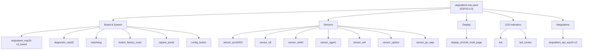

# AirGradient ESPHome firmware

ESPHome firmware for the **AirGradient ONE** (v9, ESP32-C3 indoor monitor), built on top
of
[MallocArray/airgradient_esphome](https://github.com/MallocArray/airgradient_esphome).
Designed to meet the [Made for ESPHome](https://esphome.io/guides/made_for_esphome/)
program requirements.

---

## Documentation

| Topic                      | File                                 |
| -------------------------- | ------------------------------------ |
| Installing firmware        | [docs/firmware.md](docs/firmware.md) |
| LED indicator — all modes  | [docs/led.md](docs/led.md)           |
| Display — all pages        | [docs/display.md](docs/display.md)   |
| Contributing & development | [CONTRIBUTING.md](CONTRIBUTING.md)   |
| Package reference          | [packages.md](packages.md)           |

---

## Supported devices

Every device is declared in [`devices.yaml`](devices.yaml):

- **AirGradient ONE** (`airgradient-one`) — ESP32-C3 indoor monitor

---

## Architecture

The firmware is assembled from small, single-responsibility YAML packages.
`airgradient-one.yaml` is the entry point — it declares project identity and
connectivity, then pulls in packages by category:

---

## Notable changes from upstream

- **LED**: `led_co2` replaced by `led_combo` — ten selectable modes, health-based
  thresholds, perceptual brightness correction, LED fade effect. See
  [docs/led.md](docs/led.md).
- **Display**: multi-page OLED with nine selectable pages plus a boot page. See
  [docs/display.md](docs/display.md).
- **CI/CD**: full automated release pipeline — `validate.yml`, `build-firmware.yml`,
  `devices.yaml` registry, OTA via `update.http_request`. See
  [CONTRIBUTING.md](CONTRIBUTING.md).
- **Scope**: D1 Mini / ESP8266 support removed; targets ESP32-C3 only.
- **Identity**: `name_add_mac_suffix: true`; project name `luukvisser.airgradient-one`.

---

## Made for ESPHome compliance

| Requirement               | Where it's satisfied                               |
| ------------------------- | -------------------------------------------------- |
| ESP32 / supported variant | Set per device in its `packages/` board file       |
| `project` identification  | `esphome.project` in each device's YAML            |
| Open-source configuration | this repository                                    |
| User-applied updates      | `update.http_request` → per-device `manifest.json` |
| Wi-Fi provisioning (BLE)  | `esp32_improv`                                     |
| Wi-Fi provisioning (USB)  | `improv_serial`                                    |
| Fallback Wi-Fi AP         | `wifi.ap` + `captive_portal`                       |
| Dashboard adoption        | `dashboard_import.package_import_url`              |
| No secrets / static IPs   | credential fields are commented out                |
| IDs on components         | every top-level component has an explicit `id:`    |
