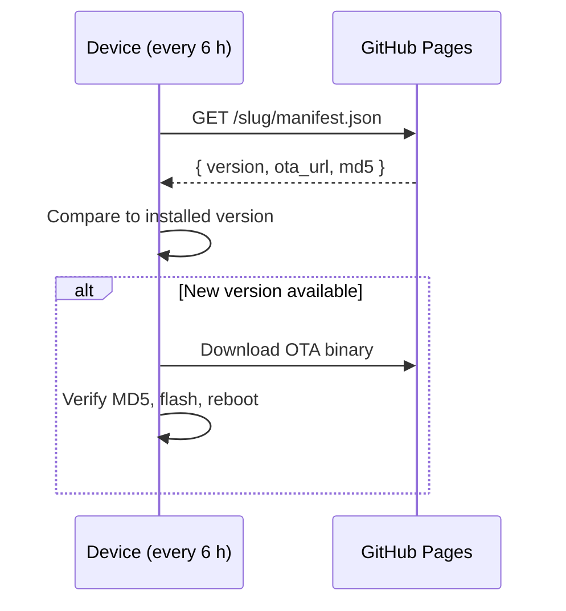

# Installing firmware

The easiest way to flash firmware is directly from the browser — no ESPHome or Python
installation required.

1. Open
   **[luukvisser.github.io/airgradient_esphome](https://luukvisser.github.io/airgradient_esphome/)**
   in a Chromium-based browser (Chrome or Edge — Firefox does not support Web Serial).
2. The page lists all supported devices, each with an **Install** button.

   

3. Plug your device into your computer via USB.
4. Click **Install** next to your device.
5. The browser will prompt you to select a serial port — choose the one that corresponds
   to your device (typically listed as `USB Serial` or similar).
6. Follow the on-screen prompts. The installer will erase and flash the latest released
   firmware automatically.

> **Note:** The install page is only live after the first release has been published via
> the CI/CD pipeline. If the page returns a 404, no release has been tagged yet.

---

## Published URLs

After the first release, every device has the following URLs:

```
https://luukvisser.github.io/airgradient_esphome/                         # landing page
https://luukvisser.github.io/airgradient_esphome/<slug>/manifest.json     # update manifest
https://luukvisser.github.io/airgradient_esphome/<slug>/firmware/latest/  # latest binaries
https://luukvisser.github.io/airgradient_esphome/<slug>/firmware/<ver>/   # pinned version
```

---

## OTA updates

Once flashed, the device updates itself automatically. Every 6 hours it polls its
manifest URL, compares the available version to the installed one, and installs any
update in the background:


