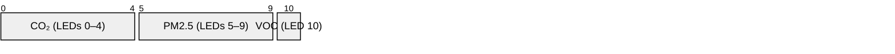
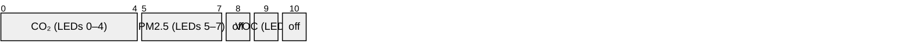
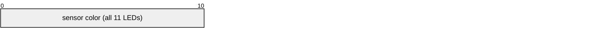
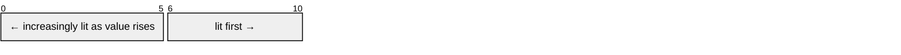
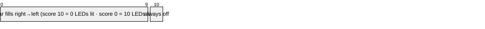

# LED indicator

The `led_combo` package drives a WS2812 11-LED strip (GPIO10). Ten modes are selectable
from Home Assistant or the built-in web UI (default: **Combo**).

---

## Modes at a glance

| Mode            | LED layout                                                    | Sensors         |
| --------------- | ------------------------------------------------------------- | --------------- |
| **Combo** ★     | 5 LEDs CO₂ · 5 LEDs PM2.5 · 1 LED VOC                         | CO₂, PM2.5, VOC |
| **Combo 5-3-1** | 5 CO₂ · 3 PM2.5 · 1 VOC · 2 off                               | CO₂, PM2.5, VOC |
| **CO2**         | All 11 LEDs reflect CO₂                                       | CO₂             |
| **PM2.5**       | All 11 LEDs reflect PM2.5                                     | PM2.5           |
| **VOC**         | All 11 LEDs reflect VOC index                                 | VOC             |
| **CO2 Bar**     | Bar fills right→left; 1 LED at ≤ 500 ppm → 11 at ≥ 2 000 ppm  | CO₂             |
| **PM2.5 Bar**   | Bar fills right→left; 1 LED at ≤ 5 µg/m³ → 11 at ≥ ~150 µg/m³ | PM2.5           |
| **GO IAQS**     | Bar fills right→left from score 0–10; LED 10 always off       | GO IAQS score   |
| **Test**        | All 11 LEDs white at full brightness                          | —               |
| **Off**         | Strip off                                                     | —               |

★ default on first boot

---

## LED layouts

**Combo** — three sensors in three zones:

**Combo 5-3-1** — compact variant, LEDs 8 and 10 unused:

**CO2 / PM2.5 / VOC** — single sensor across all 11 LEDs:

**CO2 Bar / PM2.5 Bar** — quantity bar that grows right→left as the value rises:

| Bar mode      | 1 LED lit (right) | All 11 LEDs lit | Step per LED |
| ------------- | ----------------- | --------------- | ------------ |
| **CO2 Bar**   | ≤ 500 ppm         | ≥ 2 000 ppm     | 150 ppm      |
| **PM2.5 Bar** | ≤ 5 µg/m³         | ≥ ~150 µg/m³    | 14.5 µg/m³   |

**GO IAQS** — score bar, LED 10 always off:

| GO IAQS score | LEDs lit | Color  |
| ------------- | -------- | ------ |
| 8 – 10        | 0 – 2    | Green  |
| 4 – 7         | 3 – 6    | Orange |
| 0 – 3         | 7 – 10   | Red    |

**Test** — all 11 LEDs white at full brightness (hardware check). **Off** — strip off.

---

## Color thresholds

Colors transition smoothly between steps. Thresholds follow published health guidelines.

| Color  | CO₂ (ppm)     | PM2.5 (µg/m³) | VOC index |
| ------ | ------------- | ------------- | --------- |
| Green  | < 600         | < 5           | < 100     |
| Yellow | 600 – 900     | 5 – 15        | 100 – 200 |
| Orange | 900 – 1 000   | 15 – 25       | 200 – 300 |
| Red    | 1 000 – 1 200 | 25 – 35       | 300 – 400 |
| Purple | > 1 200       | > 35          | > 400     |

CO₂ thresholds follow ASHRAE/UBA indoor ventilation guidance. PM2.5 thresholds follow
the 2021 WHO global air quality guidelines. VOC thresholds follow Sensirion SGP41 index
interpretation (100 = learned baseline for this environment).

All thresholds are configurable via `substitutions` in `packages/led_combo.yaml`.

---

## Brightness and effects

**Perceptual brightness correction** — a gamma ~2.0 curve is applied to the **LED
Brightness %** slider so the low end of the range produces visibly distinct levels
instead of spending most of the range near-off.

**LED fade** — outer LEDs in each group are dimmed relative to the centre LED,
controlled by the **LED Fade %** slider. Set to 0 for uniform brightness across a group.
